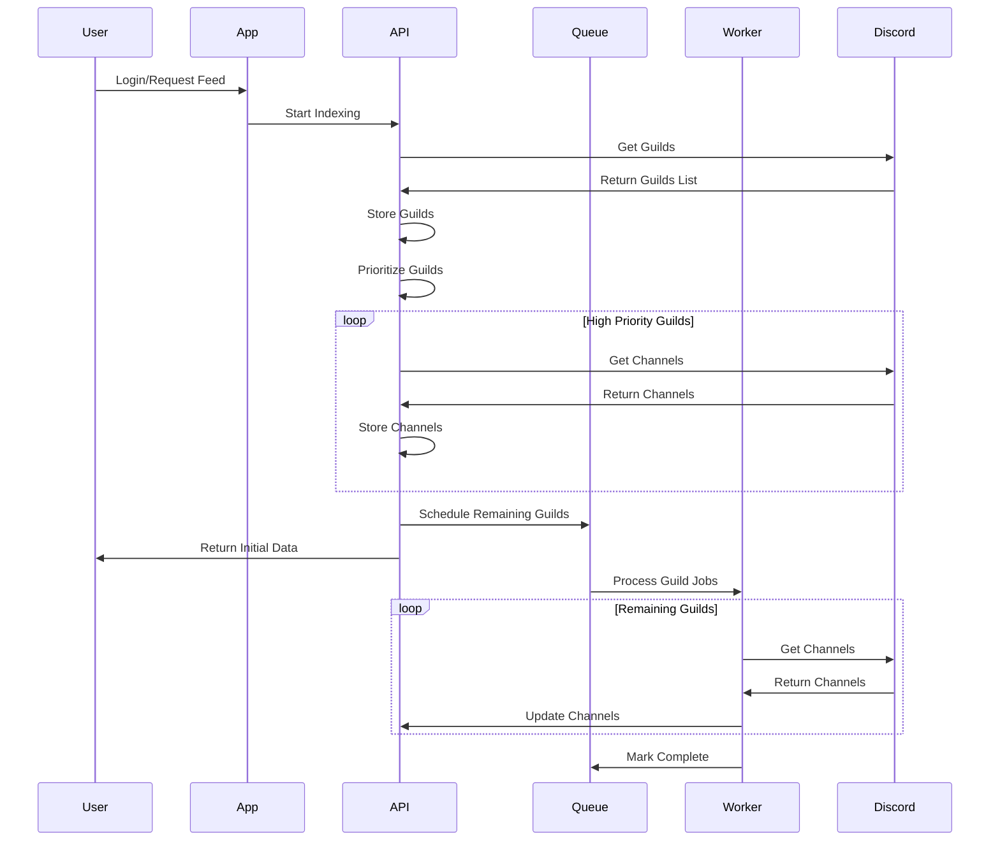

# Channel Indexing Strategy Creative Phase

## Problem Statement

Design an efficient channel indexing system that:

1. Fetches and indexes all user's Discord servers and channels
2. Respects Discord API rate limits
3. Optimizes for performance and resource usage
4. Provides fresh data without excessive API calls
5. Scales with the number of users and servers

## Requirements & Constraints

- Discord API has strict rate limits (50 requests/second global, 5 requests/5 seconds per user)
- Must handle users with 50+ servers
- Must be able to index thousands of channels across all servers
- Should prioritize active/important channels
- Must minimize unnecessary API calls
- Should handle Discord API errors gracefully

## Options Considered

### Option 1: Full Synchronous Indexing

```typescript
// Simple approach - index everything at once
async function indexAllChannels(userId: string) {
  // Get user with Discord token
  const user = await prisma.user.findUnique({ where: { id: userId } });
  const api = new DiscordAPI(user.accessToken);

  // Get all guilds
  const guilds = await api.getGuilds();

  // For each guild, get and store channels
  for (const guild of guilds) {
    await storeGuild(userId, guild);
    const channels = await api.getGuildChannels(guild.id);
    await storeChannels(guild.id, channels);
  }
}
```

**Pros:**

- Simple implementation
- Complete data in a single operation
- Easy to understand and debug

**Cons:**

- Can easily hit rate limits with many servers
- Blocking operation that may take a long time
- Not resilient to API failures

### Option 2: Queue-based Asynchronous Indexing

```typescript
// Queue-based approach using a background worker
async function scheduleIndexing(userId: string) {
  // Add indexing job to queue
  await queue.add(
    "indexUser",
    { userId },
    {
      attempts: 3,
      backoff: {
        type: "exponential",
        delay: 5000,
      },
    }
  );

  return { status: "scheduled" };
}

// Worker process
async function indexUserWorker(job) {
  const { userId } = job.data;
  const user = await prisma.user.findUnique({ where: { id: userId } });
  const api = new DiscordAPI(user.accessToken);

  // Get all guilds
  const guilds = await api.getGuilds();

  // For each guild, add a separate job
  for (const guild of guilds) {
    await queue.add(
      "indexGuild",
      {
        userId,
        guildId: guild.id,
        guildData: guild,
      },
      {
        attempts: 3,
        backoff: { type: "exponential", delay: 2000 },
      }
    );
  }
}

// Guild indexing worker
async function indexGuildWorker(job) {
  const { userId, guildId, guildData } = job.data;

  // Store guild data
  await storeGuild(userId, guildData);

  // Get user for token
  const user = await prisma.user.findUnique({ where: { id: userId } });
  const api = new DiscordAPI(user.accessToken);

  // Get and store channels
  const channels = await api.getGuildChannels(guildId);
  await storeChannels(guildId, channels);
}
```

**Pros:**

- Non-blocking architecture
- Better rate limit handling with queue throttling
- More resilient to API failures
- Can be distributed across multiple workers

**Cons:**

- More complex implementation
- Requires additional infrastructure (Redis, worker processes)
- Harder to debug issues
- May have higher latency for initial data availability

### Option 3: Priority-based Progressive Indexing

```typescript
// Priority-based approach, focusing on active/important channels first
async function priorityIndexing(userId: string) {
  const user = await prisma.user.findUnique({ where: { id: userId } });
  const api = new DiscordAPI(user.accessToken);

  // Get all guilds
  const guilds = await api.getGuilds();

  // Store basic guild data immediately
  await Promise.all(guilds.map((guild) => storeGuild(userId, guild)));

  // Get user preferences to determine priorities
  const preferences = await prisma.userPreference.findUnique({
    where: { userId },
  });

  // Sort guilds by priority (user preferences, last activity, etc.)
  const prioritizedGuilds = prioritizeGuilds(guilds, preferences);

  // For high-priority guilds, index immediately
  const highPriority = prioritizedGuilds.slice(0, 5);
  await Promise.all(
    highPriority.map(async (guild) => {
      const channels = await api.getGuildChannels(guild.id);
      await storeChannels(guild.id, channels);
    })
  );

  // For medium and low priority, schedule background indexing
  const remaining = prioritizedGuilds.slice(5);
  await queue.add(
    "indexRemainingGuilds",
    {
      userId,
      guildIds: remaining.map((g) => g.id),
    },
    {
      delay: 5000, // Start after a delay
      attempts: 3,
    }
  );

  return {
    status: "partial",
    indexed: highPriority.length,
    remaining: remaining.length,
  };
}
```

**Pros:**

- Balances immediate data needs with rate limiting
- Prioritizes important servers/channels
- Good user experience (fast initial load)
- Efficient use of API resources

**Cons:**

- Requires more complex prioritization logic
- May need to handle incomplete data scenarios
- Requires preference tracking

## Selected Approach

**Option 3: Priority-based Progressive Indexing**

### Justification

1. User Experience:

   - Provides the most important data quickly
   - Progressively loads additional data
   - Balances immediacy with completeness

2. API Efficiency:

   - Respects rate limits by spreading requests
   - Prioritizes resources based on user behavior
   - Minimizes unnecessary API calls

3. Scalability:

   - Works well with large numbers of servers
   - Can be distributed across workers
   - Handles varying loads gracefully

4. Resilience:
   - Gracefully handles API failures
   - Can retry failed operations
   - Maintains data integrity

## Implementation Plan

1. Create Discord API client with rate limit handling
2. Implement server/channel data storage in database
3. Develop prioritization logic based on user activity
4. Set up background job queue (Bull or similar)
5. Create worker processes for background indexing
6. Implement progress tracking and status reporting
7. Add error handling and retry mechanisms

## Channel Indexing Flow



## Required Dependencies

- discord.js for API interactions
- bull for job queue management
- ioredis for Redis communication
- backoff strategies for rate limiting
