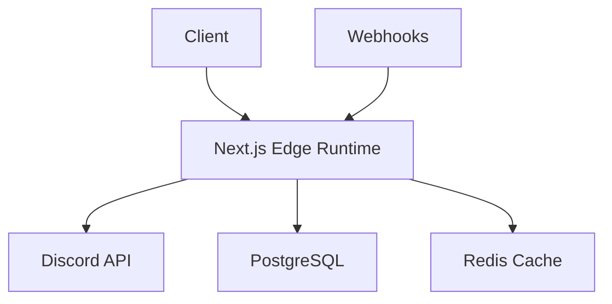

> ### ⚠️ DEPRECATED: DiscordFeed is No Longer Supported
>
> **This project is now deprecated and should not be used for new development.**
>
> <details>
> <summary>Why?</summary>
>
> Due to limitations in the Discord API, it is not possible to aggregate messages for users across multiple servers/channels on their behalf unless a dedicated bot is invited to every server and channel the user wishes to aggregate.
> Discord does **not** allow:
>
> - Polling or aggregating server messages via OAuth2 or user tokens (this is against Discord's Terms of Service and technically restricted).
> - Accessing server messages for a user unless your application is a bot and is explicitly invited to each server/channel.
>
> **This means:**
>
> - You cannot build a "universal Discord inbox" or message aggregator for arbitrary users/servers without requiring every user to install your bot in every server/channel they want to aggregate.
> - The only supported way to access server messages is via a bot with the correct permissions, which is not feasible for a general-purpose aggregator.
>
> _For more details, see the [Discord API documentation](https://discord.com/developers/docs/intro) and [Terms of Service](https://discord.com/terms)._
>
> </details>

---

# Discord Feed

A unified feed interface for Discord that aggregates unread messages across all your servers into a single, organized view.

**Status**

[](https://github.com/SimplySylvia/DiscordFeed/actions/workflows/ci.yml)

<!-- Frontend -->

**Frontend**

[](https://nextjs.org) [](https://reactjs.org) [](https://www.typescriptlang.org) [](https://tailwindcss.com)

<!-- Backend & Infrastructure -->

**Backend & Infrastructure**

[](https://www.prisma.io) [](https://www.postgresql.org) [](https://redis.io) [](https://github.com/OptimalBits/bull) [](https://github.com/felixmosh/bull-board)

<!-- DevOps & Tooling -->

**DevOps & Tooling**

[](https://eslint.org) [](https://prettier.io) [](https://www.docker.com) [](https://playwright.dev)

---

## Table of Contents

- [Overview](#overview)
- [Key Features](#key-features)
- [Authentication Flow](#authentication-flow)
- [Message & Channel Indexing](#message--channel-indexing)
- [Tech Stack](#tech-stack)
  - [Frontend](#frontend)
  - [Backend](#backend)
  - [Infrastructure & Tooling](#infrastructure--tooling)
- [Database Usage](#database-usage)
- [Technical Architecture](#technical-architecture)
  - [System Design](#system-design)
  - [Core Components](#core-components)
- [Scalability and Load Balancing](#scalability-and-load-balancing)
  - [Application Layer](#application-layer)
  - [Data Layer](#data-layer)
  - [Message Aggregation & Job Queue](#message-aggregation--job-queue)
  - [Caching & Rate Limiting](#caching--rate-limiting)
  - [Real-Time & Webhooks](#real-time--webhooks)
  - [Edge Network & CDN](#edge-network--cdn)
  - [Load Balancing Strategies](#load-balancing-strategies)
- [Implementation Details](#implementation-details)
  - [Performance Optimizations](#performance-optimizations)
  - [API Integration](#api-integration)
- [Getting Started](#getting-started)
  - [Prerequisites](#prerequisites)
  - [Documentation](#documentation)
  - [Discord Application Setup](#discord-application-setup)
  - [Installation](#installation)
- [Testing](#testing)
  - [Running Tests](#running-tests)
  - [End-to-End (E2E) Testing with Playwright](#end-to-end-e2e-testing-with-playwright)
  - [Test Setup](#test-setup)
  - [Installing Test Dependencies](#installing-test-dependencies)
  - [Example Test Script in package.json](#example-test-script-in-packagejson)
  - [Configuration Files](#configuration-files)
- [Bull Board: Queue Monitoring](#bull-board-queue-monitoring)
  - [Launch Bull Board](#launch-bull-board)
- [Project Structure](#project-structure)
- [Technical Limitations and Workarounds](#technical-limitations-and-workarounds)
- [Contributing](#contributing)
- [License](#license)
- [Acknowledgments](#acknowledgments)
- [Support](#support)

---

## Overview

Discord Feed solves the common problem of missing important messages across multiple Discord servers by providing a centralized view of all unread messages. The application aggregates messages from all your Discord servers and presents them in a unified, chronological feed.

### Key Features

- 🔐 **Secure Discord OAuth2 Authentication**

  - Built with NextAuth.js, JWT sessions, and Redis for robust, scalable, and secure login and session management.
  - Edge middleware for fast token validation and secure token refresh.

- 📨 **Unified Feed of Unread Messages**

  - Aggregates unread messages from all your Discord servers and channels into a single, chronological feed.
  - Grouped by server and channel, with clear visual indicators and infinite scroll for seamless browsing.
  - Real-time unread status using custom logic (last visit timestamps, message comparison) due to Discord API limitations.

- 🔄 **Real-Time Updates & Synchronization**

  - Webhook-first architecture for instant updates where supported, with intelligent polling fallback for all other channels.
  - WebSocket support for live feed updates and cross-device sync.
  - Read status and preferences sync across devices.

- 🛠️ **Advanced Message Aggregation Engine**

  - Efficient background job system (Bull + Redis) for message fetching, caching, and unread logic.
  - Prioritizes high-activity or user-preferred channels for faster updates.
  - Handles Discord API rate limits with intelligent scheduling and retry/backoff strategies.

- 🧩 **Customizable User Experience**

  - User preferences for notification settings, refresh intervals, theme (light/dark/system), and more.
  - Filter feed by server, channel, or message type; mute/hide channels; prioritize important servers/channels.
  - Settings UI for managing all preferences.

- 📱 **Mobile-Responsive & Accessible Design**

  - Fully responsive UI for mobile, tablet, and desktop.
  - Discord-inspired interface with clear information hierarchy and accessibility best practices.

- 💬 **Rich Message Interactions**

  - Read, respond, and react to messages directly from the feed (planned/partial).
  - Inline display of media, embeds, and reactions.
  - Contextual message view with thread support and expanded context.

- ⚡ **Performance & Scalability**

  - Hybrid rendering (static + dynamic) for fast initial loads and interactive updates.
  - Edge caching, Redis caching, and global CDN distribution for low latency.
  - Horizontally scalable architecture: stateless API routes, distributed background workers, managed database and cache.

- 🛡️ **Security & Compliance**

  - OAuth2-only authentication, HTTPS everywhere, CSRF protection, and secure webhook verification.
  - Strict Discord API compliance and robust error handling.

- 🧰 **Robust Infrastructure & Tooling**

  - PostgreSQL (Prisma ORM) for persistent, type-safe data storage.
  - Redis for caching, rate limiting, and queue management.
  - Bull for distributed job processing and queue monitoring (Bull Board dashboard).
  - Docker support for local development and deployment.
  - CI/CD with GitHub Actions, planned analytics and logging integrations.

- 🧪 **Testing, Monitoring, and Extensibility**

  - Comprehensive unit and integration tests (Jest, React Testing Library).
  - Monitoring and autoscaling support (Vercel Analytics, Datadog/Prometheus planned).
  - Modular, extensible codebase for future features (message interactions, analytics, offline sync, etc.).

- 🚧 **Technical Limitations Transparently Addressed**

  - Custom unread logic and aggregation due to Discord API constraints.
  - Hybrid real-time/polling update strategy, with clear documentation of workarounds and limitations.

- 🗺️ **Planned & Future Features**

  - Infinite scroll, advanced message interactions, engagement analytics, offline support, and more (see Roadmap).

---

## Authentication Flow

DiscordFeed uses secure Discord OAuth2 authentication for user login and authorization. The authentication system is built with NextAuth.js, leveraging JWT sessions and Redis for token management. For a detailed step-by-step overview of the OAuth flow, see [User Authorization & OAuth Flow](./docs/user-authorization.md).

---

## Message & Channel Indexing

DiscordFeed uses a background queue-based system to efficiently index your Discord servers, channels, and messages. When you log in, the app checks if your servers and channels are already indexed. If not, it triggers a background process that fetches your server and channel data from Discord, stores it in the database, and schedules message aggregation jobs. Messages are fetched both on a schedule and in real-time via webhooks, and unread counts are calculated using message timestamps and your last read position. For a detailed breakdown of this process, see [Message & Channel Indexing Flow](./docs/indexing.md).

---

## Tech Stack

### Frontend

- **Framework:** Next.js 15 (App Router)
- **UI:** React 18 (Server and Client Components)
- **Styling:** Tailwind CSS
- **State Management:** React Context, Server Actions
- **Type Checking:** TypeScript 5
- **Testing:** Jest, React Testing Library, **Playwright (E2E)**

### Backend

- **API:** Next.js API Routes
- **Auth:** NextAuth.js
- **ORM:** Prisma (with @prisma/client)
- **Database:** PostgreSQL (Vercel Postgres)
- **Caching/Queue:** Redis (ioredis, Vercel KV)
- **Job Queue:** Bull
- **Discord Integration:** discord.js

### Infrastructure & Tooling

- **Containerization:** Docker (with docker-compose for local/dev)
- **CI/CD:** GitHub Actions
- **Monitoring:** Vercel Analytics (Datadog/Prometheus + Grafana — planned)
- **Logging:** (ELK Stack — planned)
- **Queue Monitoring:** Bull Board (@bull-board/api, @bull-board/express)
- **E2E Testing:** **Playwright**
- **Environment Management:** dotenv-cli
- **Build Tools:** tsx, TypeScript, PostCSS, Autoprefixer
- **Linting:** ESLint, eslint-config-next
- **Code Formatting:** Prettier

---

## Database Usage

This project uses **PostgreSQL** as its primary database, managed through the [Prisma](https://www.prisma.io/) ORM. Prisma provides type-safe database access, schema migrations, and a modern query builder for Node.js and TypeScript. All data models, relationships, and migrations are defined in the [`prisma/`](./prisma) directory.

- **ORM**: Prisma Client is auto-generated from the schema and used throughout the backend for safe, efficient queries.
- **Migrations**: Database schema changes are tracked and applied using Prisma Migrate.
- **Schema**: The full data model and entity relationships are defined in [`prisma/schema.prisma`](./prisma/schema.prisma).
- **Visual ERD**: For a full entity relationship diagram and more Prisma-specific documentation, see [`prisma/README.md`](./prisma/README.md).

---

## Technical Architecture

### System Design

The application follows a hybrid architecture leveraging Next.js 15's capabilities:



### Core Components

1. **Authentication Layer**

   - NextAuth.js for Discord OAuth2
   - Secure token management
   - Session handling

2. **Data Layer**

   - PostgreSQL for persistent storage
   - Redis for caching and rate limiting
   - Message aggregation engine

3. **API Layer**

   - Next.js API Routes
   - Edge-compatible Discord.js
   - Webhook handlers

4. **Frontend Layer**
   - React Server Components
   - Client Components for interactivity
   - Real-time updates via WebSocket

---

## Scalability and Load Balancing

DiscordFeed is architected for horizontal scalability and robust load balancing at every layer of the stack. Here's how the application achieves this:

### Application Layer

- **Next.js 15 (Edge/Serverless):** The app leverages Next.js 15, supporting both edge and serverless runtimes. This enables horizontal scaling by running multiple stateless instances across a global CDN or serverless infrastructure (e.g., Vercel, AWS Lambda).
- **Hybrid Rendering:** Combines static server routes (for fast initial loads) and dynamic client/server components (for interactivity and real-time updates), reducing backend load for static content and scaling dynamic content as needed.
- **Stateless API Routes:** API routes are stateless and can be deployed behind a load balancer to distribute incoming HTTP requests across multiple instances.

### Data Layer

- **PostgreSQL (Vercel Postgres):** Used for persistent storage. PostgreSQL can be scaled vertically (larger instance) or horizontally (read replicas, sharding for very large scale).
- **Redis (Vercel KV):** Used for caching, rate limiting, and as a message queue backend. Redis is highly performant and can be clustered for high availability and throughput.

### Message Aggregation & Job Queue

- **Bull Queue (with Redis):**
  - Distributed processing: Multiple worker processes (or containers) can pull from the same queue, enabling horizontal scaling of background jobs.
  - Retry/backoff: Failed jobs are retried with exponential backoff, and persistent failures are logged for monitoring.
  - Priority & scheduling: Jobs can be prioritized and scheduled (e.g., high-priority channels polled more frequently).
  - Monitoring: Bull Board provides a dashboard for monitoring and managing jobs.

### Caching & Rate Limiting

- **Redis Caching:** Frequently accessed data (like recent messages per channel) is cached in Redis, reducing database and API load.
- **Rate Limiting:** Both API requests to Discord and internal endpoints are rate-limited using Redis, preventing overload and handling Discord's strict rate limits.

### Real-Time & Webhooks

- **WebSocket & Webhooks:** Real-time updates are delivered via WebSockets and Discord webhooks, reducing the need for constant polling and enabling efficient, event-driven updates.

### Edge Network & CDN

- **Global CDN Distribution:** Static assets and edge functions are distributed globally, reducing latency and offloading traffic from the origin server.

### Load Balancing Strategies

- **Horizontal Scaling:** Multiple instances of the app (API and workers) can be run in parallel, either as containers (Docker/Kubernetes) or serverless functions.
- **Distributed Workers:** Any number of worker processes can be started (locally or in the cloud), all pulling from the same Bull/Redis queue. This allows the system to handle spikes in message aggregation or processing load.
- **Managed Services:** Use managed PostgreSQL and Redis services with support for scaling, replication, and failover.
- **CDN and Edge Functions:** Leverage CDN and edge functions for static assets and edge-optimized API routes.
- **Monitoring and Autoscaling:** Monitor and autoscale based on queue length, API response times, and resource utilization.

#### Summary Table

| Layer        | Scalability Feature            | Load Balancing Approach          |
| ------------ | ------------------------------ | -------------------------------- |
| Frontend/API | Next.js Edge/Serverless        | Platform/Cloud load balancer     |
| Background   | Bull Queue + Redis             | Multiple distributed workers     |
| Database     | PostgreSQL (Prisma ORM)        | Read replicas, sharding, pooling |
| Cache/Queue  | Redis (caching, rate limiting) | Redis clustering, managed Redis  |
| Real-time    | WebSocket, Webhooks            | Event-driven, not polling-heavy  |

**In summary:** DiscordFeed is designed for robust, cloud-native scalability and can handle high load by distributing work across multiple stateless services, background workers, and managed infrastructure components. Load balancing is achieved at both the application and background processing layers, coordinated via Redis and managed by the hosting/cloud platform's load balancer.

---

## Implementation Details

### Performance Optimizations

1. **Edge Network**

   - Cache frequent API responses
   - Stale-while-revalidate for message updates
   - Global CDN distribution

2. **Hybrid Rendering**

   - Static Server Routes for initial load
   - Dynamic Client Components for interactivity
   - WebSocket for real-time updates

3. **Security Measures**
   - Next.js middleware for rate limiting
   - CSRF protection for form actions
   - Secure webhook verification

### API Integration

- OAuth2 authentication via NextAuth.js
- Channel/message endpoints for data retrieval
- Gateway API for real-time updates
- Webhooks for notifications

---

## Getting Started

### Prerequisites

- Node.js 18.0 or later
- PostgreSQL database
- Redis instance
- Discord Developer Account

### Documentation

For detailed setup instructions, refer to the documentation:

- [Complete Documentation Index](./docs/README.md)
- [Environment Setup Guide](./docs/environment-setup.md)
- [PostgreSQL Setup Guide](./docs/postgresql-setup.md)
- [Redis Setup Guide](./docs/redis-setup.md)
- [Docker Compose Setup Guide](./docs/docker-compose-setup.md) (alternative)

### Discord Application Setup

1. Go to the [Discord Developer Portal](https://discord.com/developers/applications)
2. Create a new application
3. Navigate to the "OAuth2" section
4. Add a redirect URL: `http://localhost:3000/api/auth/callback/discord`
5. Copy the Client ID and Client Secret to use in your environment variables

### Installation

1. Clone the repository:

   ```bash
   git clone https://github.com/yourusername/discordfeed.git
   cd discordfeed
   ```

2. Install dependencies:

   ```bash
   npm install
   ```

3. (Optional) To run tests and verify your setup:

   ```bash
   npm run test
   ```

4. Set up environment variables:

   Follow the [Environment Setup Guide](./docs/environment-setup.md) to configure your `.env.local` file.

5. Set up the database:

   Follow the [PostgreSQL Setup Guide](./docs/postgresql-setup.md) or use the [Docker Compose Setup Guide](./docs/docker-compose-setup.md).

   Then run:

   ```bash
   npx prisma generate
   npx prisma migrate dev --name init
   ```

6. Set up Redis:

   Follow the [Redis Setup Guide](./docs/redis-setup.md) or use the [Docker Compose Setup Guide](./docs/docker-compose-setup.md).

7. Run the development server:

   ```bash
   npm run dev
   ```

8. Open [http://localhost:3000](http://localhost:3000) in your browser

---

## Testing

This project uses **Jest** and **React Testing Library** for unit and integration testing, and **Playwright** for end-to-end (E2E) testing with full TypeScript support.

### Running Tests

To run all unit and integration tests:

```bash
npm run test
```

### End-to-End (E2E) Testing with Playwright

**Playwright** is used for E2E browser testing. E2E tests are located in the `e2e/` directory and cover authentication, navigation, feed, settings, and more.

#### Running E2E Tests

1. **Ensure your development server is running:**
   ```bash
   npm run dev
   ```
2. **(First time only) Set up authentication state:**
   - Run the following command to open a browser and log in via Discord:
     ```bash
     npx playwright test e2e/auth.setup.spec.ts --headed --project=chromium
     ```
   - Complete the login in the browser window, then resume the test in the Playwright UI. This will save your authentication state to `e2e/.auth/user.json`.
   - You only need to do this once, unless you delete the `.auth/user.json` file.
3. **Run all E2E tests:**
   ```bash
   npm run test:e2e
   ```
   or directly:
   ```bash
   npx playwright test e2e
   ```

#### Notes

- The E2E tests will use the saved authentication state for logged-in scenarios.
- If you need to reset authentication, delete `e2e/.auth/user.json` and repeat step 2.
- Playwright tests can be run in headless or headed mode. For debugging, add `--headed`.
- To run a single test file or test, use:
  ```bash
  npx playwright test e2e/feed.spec.ts
  ```

### Test Setup

- **Jest** is configured for TypeScript using `ts-jest`.
- **React Testing Library** is used for component testing.
- **Playwright** is configured for E2E browser testing.
- The test environment is set to `jsdom` for browser-like testing (unit/integration).
- All test files should use the `.test.ts`, `.test.tsx`, or `.spec.ts` extension and can be placed next to the components or in a `__tests__/` or `e2e/` directory.

### Installing Test Dependencies

If you need to install test dependencies manually, run:

```bash
npm install --save-dev jest @types/jest ts-jest @testing-library/react @testing-library/jest-dom @testing-library/user-event identity-obj-proxy jest-environment-jsdom playwright @playwright/test
```

### Example Test Scripts in package.json

```json
"scripts": {
  // ...other scripts
  "test": "jest",
  "test:e2e": "node e2e/auth-setup.js && playwright test"
}
```

### Configuration Files

- `jest.config.js`: Jest configuration for TypeScript and React Testing Library.
- `jest.setup.ts`: Jest setup file for extending Jest matchers.
- `playwright.config.ts`: Playwright configuration for E2E tests.
- `e2e/auth-setup.js`: Script to ensure authentication state is set up before running E2E tests.

For more details, see the configuration files in the project root and the `e2e/` directory.

## Bull Board: Queue Monitoring

For local development, you can monitor all Bull queues (including message aggregation) using Bull Board:

### Launch Bull Board

```bash
npx ts-node scripts/bull-board.ts
```

This will start a dashboard at [http://localhost:3001/admin/queues](http://localhost:3001/admin/queues) where you can view, retry, and manage jobs.

**Note:** Bull Board is for local/dev use. For production, secure access or run Bull Board as a separate, protected service.

---

## Project Structure

```
discordfeed/
├── app/                    # Next.js app directory (routing, pages, layouts, global styles)
│   ├── api/                # API routes (REST endpoints for messages, webhooks, servers, preferences, etc.)
│   ├── feed/               # Feed page and components (unified message feed)
│   ├── settings/           # User settings page and components
│   ├── login/              # Login page and components
│   ├── providers.tsx       # React context providers
│   ├── layout.tsx          # Root layout for the app
│   ├── page.tsx            # Main entry page
│   └── globals.css         # Global CSS (Tailwind base)
├── components/             # (If present) Shared React components (UI elements, widgets, etc.)
├── lib/                    # Utility libraries and backend helpers
│   ├── discord/            # Discord API integration, message aggregation, queue logic
│   ├── auth/               # Authentication utilities (e.g., Redis session helpers)
│   ├── prisma-adapter.ts   # NextAuth.js Prisma adapter
│   ├── prisma.ts           # Prisma client instance
│   └── test-db.ts          # Test database utilities
├── prisma/                 # Database schema and migrations
│   ├── schema.prisma       # Prisma schema (data models)
│   ├── migrations/         # Database migration files (SQL)
│   └── README.md           # Prisma/database documentation
├── docs/                   # Project documentation
│   ├── README.md           # Documentation index
│   ├── environment-setup.md# Environment setup guide
│   ├── postgresql-setup.md # PostgreSQL setup guide
│   ├── redis-setup.md      # Redis setup guide
│   ├── docker-compose-setup.md # Docker Compose setup guide
│   ├── indexing.md         # Message & channel indexing flow
│   └── user-authorization.md # OAuth flow details
├── scripts/                # Development and operational scripts
│   ├── bull-board.ts       # Script to launch Bull Board (queue monitoring dashboard)
│   └── setup.sh            # Project setup script
├── types/                  # Custom TypeScript type definitions
│   └── next-auth.d.ts      # NextAuth.js type extensions
├── .memory-bank/           # Project planning, creative/design phase docs, and progress tracking
│   ├── activeContext.md    # Current project focus/context
│   ├── progress.md         # Progress tracking
│   ├── tasks.md            # Task breakdown and status
│   ├── techContext.md      # Technical context and stack
│   ├── projectbrief.md     # Project brief/overview
│   ├── projectStructure.md # (If present) Structure documentation
│   └── creative-phases/    # Design/architecture decision docs (auth, database, aggregation, etc.)
├── .gitignore              # Git ignore file
├── package.json            # Project manifest (dependencies, scripts)
├── package-lock.json       # Dependency lockfile
├── tsconfig.json           # TypeScript configuration
├── next-env.d.ts           # Next.js/TypeScript environment types
├── next.config.js          # Next.js configuration
├── tailwind.config.js      # Tailwind CSS configuration
├── postcss.config.js       # PostCSS configuration
├── docker-compose.yml      # Docker Compose configuration
├── .prettierrc             # Prettier code formatting config
├── .prettierignore         # Prettier ignore file
├── .nvmrc                  # Node version manager config
├── PRD.md                  # Product Requirements Document
└── README.md               # Main project readme
```

---

## Technical Limitations and Workarounds

1. **No Unread Messages API**

   - **Workaround**: Track last visit timestamps per channel
   - **Implementation**: Custom logic for message comparison

2. **Rate Limiting**

   - **Workaround**: Intelligent caching and staggered API calls
   - **Implementation**: Redis-based rate limiting

3. **Message History**

   - **Workaround**: Focus on recent unread messages
   - **Implementation**: On-demand loading

4. **Real-time Updates**
   - **Workaround**: Webhooks + periodic polling
   - **Implementation**: Hybrid update strategy

---

## Contributing

We welcome contributions! Please read our [Contributing Guidelines](CONTRIBUTING.md) for details on our code of conduct and the process for submitting pull requests.

1. Fork the repository
2. Create your feature branch (`git checkout -b feature/amazing-feature`)
3. Commit your changes (`git commit -m 'Add some amazing feature'`)
4. Push to the branch (`git push origin feature/amazing-feature`)
5. Open a Pull Request

## License

This project is licensed under the MIT License - see the [LICENSE](LICENSE) file for details.

## Acknowledgments

- Discord API team for their excellent documentation
- Next.js team for their amazing framework
- All contributors who have helped shape this project

## Support

For support, please open an issue in the GitHub repository.

---

Made with ❤️
