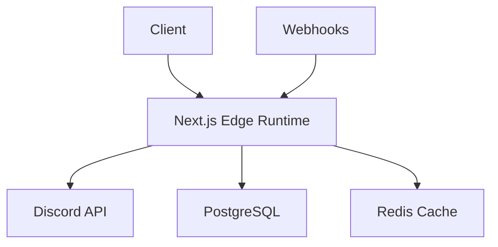

# Discord Feed

> ⚠️ **Pre-Development Notice**: This project is currently in pre-development phase. The repository is being set up and documentation is being prepared. No code has been implemented yet. Stay tuned for updates!

A unified feed interface for Discord that aggregates unread messages across all your servers into a single, organized view.

[](https://nextjs.org)
[](https://reactjs.org)
[](https://www.typescriptlang.org)
[](https://www.postgresql.org)
[](https://redis.io)

## Overview

Discord Feed solves the common problem of missing important messages across multiple Discord servers by providing a centralized view of all unread messages. The application aggregates messages from all your Discord servers and presents them in a unified, chronological feed.

### Key Features

- 🔐 Secure Discord OAuth2 authentication
- 📱 Unified feed of unread messages across all servers
- 🔄 Real-time message updates
- 🎨 Discord-inspired interface
- 📊 Server and channel prioritization
- 🔔 Customizable notification settings
- 📱 Mobile-responsive design

## Technical Architecture

### System Design

The application follows a hybrid architecture leveraging Next.js 15's capabilities:



### Core Components

1. **Authentication Layer**

   - NextAuth.js for Discord OAuth2
   - Secure token management
   - Session handling

2. **Data Layer**

   - PostgreSQL for persistent storage
   - Redis for caching and rate limiting
   - Message aggregation engine

3. **API Layer**

   - Next.js API Routes
   - Edge-compatible Discord.js
   - Webhook handlers

4. **Frontend Layer**
   - React Server Components
   - Client Components for interactivity
   - Real-time updates via WebSocket

## Tech Stack

### Frontend

- **Framework**: Next.js 15 (App Router)
- **UI**: React Server Components, Client Components
- **Styling**: Tailwind CSS
- **State Management**: React Context + Server Actions
- **Testing**: Jest, React Testing Library

### Backend

- **API**: Next.js API Routes
- **Auth**: NextAuth.js
- **ORM**: Prisma
- **Database**: PostgreSQL (Vercel Postgres)
- **Caching**: Redis (Vercel KV)
- **Real-time**: WebSocket, Webhooks

### Infrastructure

- **Hosting**: Vercel (Edge and Serverless Functions)
- **CI/CD**: GitHub Actions
- **Monitoring**: Vercel Analytics, Datadog/Prometheus + Grafana
- **Logging**: ELK Stack

## Data Models

```typescript
interface User {
  id: string;
  discordId: string;
  accessToken: string;
  refreshToken: string;
  lastLogin: timestamp;
  preferences: UserPreferences;
}

interface UserPreferences {
  userId: string;
  themeSetting: string;
  serverPriorities: ServerPriority[];
  mutedChannels: string[];
  notificationSettings: NotificationSetting[];
}

interface ServerMetadata {
  id: string;
  discordServerId: string;
  name: string;
  icon: string;
  channels: ChannelMetadata[];
}

interface MessageCache {
  id: string;
  discordMessageId: string;
  channelId: string;
  content: string;
  authorId: string;
  authorName: string;
  timestamp: timestamp;
  attachments: Attachment[];
  embeds: Embed[];
  reactions: Reaction[];
  isRead: boolean;
}
```

## Implementation Details

### Performance Optimizations

1. **Edge Network**

   - Cache frequent API responses
   - Stale-while-revalidate for message updates
   - Global CDN distribution

2. **Hybrid Rendering**

   - Static Server Routes for initial load
   - Dynamic Client Components for interactivity
   - WebSocket for real-time updates

3. **Security Measures**
   - Next.js middleware for rate limiting
   - CSRF protection for form actions
   - Secure webhook verification

### API Integration

- OAuth2 authentication via NextAuth.js
- Channel/message endpoints for data retrieval
- Gateway API for real-time updates
- Webhooks for notifications

## Getting Started

### Prerequisites

- Node.js 18.0 or later
- PostgreSQL database
- Redis instance
- Discord Developer Account

### Installation

1. Clone the repository:

   ```bash
   git clone https://github.com/simplysylvia/discordfeed.git
   cd discordfeed
   ```

2. Install dependencies:

   ```bash
   npm install
   ```

3. Set up environment variables:

   ```bash
   cp .env.example .env.local
   ```

   Fill in the required environment variables in `.env.local`

4. Set up the database:

   ```bash
   npx prisma generate
   npx prisma migrate dev
   ```

5. Run the development server:

   ```bash
   npm run dev
   ```

6. Open [http://localhost:3000](http://localhost:3000) in your browser

## Project Structure

```
discordfeed/
├── app/                    # Next.js app directory
│   ├── api/               # API routes
│   ├── feed/              # Feed page components
│   └── auth/              # Authentication pages
├── components/            # Reusable components
├── lib/                   # Utility functions
├── prisma/               # Database schema and migrations
│   ├── schema.prisma     # Prisma schema
│   └── migrations/       # Database migrations
└── public/               # Static assets
```

## Technical Limitations and Workarounds

1. **No Unread Messages API**

   - **Workaround**: Track last visit timestamps per channel
   - **Implementation**: Custom logic for message comparison

2. **Rate Limiting**

   - **Workaround**: Intelligent caching and staggered API calls
   - **Implementation**: Redis-based rate limiting

3. **Message History**

   - **Workaround**: Focus on recent unread messages
   - **Implementation**: On-demand loading

4. **Real-time Updates**
   - **Workaround**: Webhooks + periodic polling
   - **Implementation**: Hybrid update strategy

## Contributing

We welcome contributions! Please read our [Contributing Guidelines](CONTRIBUTING.md) for details on our code of conduct and the process for submitting pull requests.

1. Fork the repository
2. Create your feature branch (`git checkout -b feature/amazing-feature`)
3. Commit your changes (`git commit -m 'Add some amazing feature'`)
4. Push to the branch (`git push origin feature/amazing-feature`)
5. Open a Pull Request

## License

This project is licensed under the MIT License - see the [LICENSE](LICENSE) file for details.

## Acknowledgments

- Discord API team for their excellent documentation
- Next.js team for their amazing framework
- All contributors who have helped shape this project

## Support

For support, please open an issue in the GitHub repository or join our [Discord server](https://discord.gg/your-server).

## Roadmap

See our [project board](https://github.com/simplysylvia/discordfeed/projects) for planned features and future development.

---

Made with ❤️
