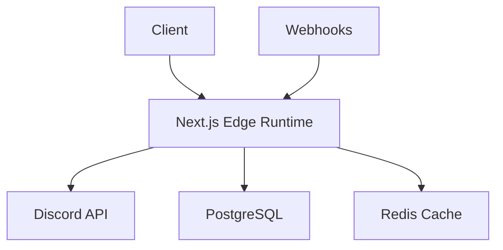

# Discord Feed Documentation

Welcome to the Discord Feed documentation. This directory contains guides to help you set up and run the Discord Feed application.

## Getting Started

First, follow these guides in order:

1. [Environment Setup Guide](./environment-setup.md) - Set up required environment variables
2. [Database Setup Guide](./postgresql-setup.md) - Set up PostgreSQL database
3. [Redis Setup Guide](./redis-setup.md) - Set up Redis for caching and session storage

## Alternative Setup

For a streamlined development environment:

- [Docker Compose Setup Guide](./docker-compose-setup.md) - Set up PostgreSQL and Redis using Docker Compose

## Application Architecture

Discord Feed follows a hybrid architecture leveraging Next.js 15's capabilities:

## Tech Stack

- **Frontend**: Next.js 15 (App Router), React, Tailwind CSS
- **Backend**: Next.js API Routes, NextAuth.js
- **Database**: PostgreSQL (via Prisma ORM)
- **Caching**: Redis
- **Infrastructure**: Vercel (Edge and Serverless Functions)

## Troubleshooting

If you encounter issues during setup or running the application, please refer to the troubleshooting sections in each guide or open an issue in the GitHub repository.

## Contributing

Please read our [Contributing Guidelines](../CONTRIBUTING.md) for details on our code of conduct and the process for submitting pull requests.
