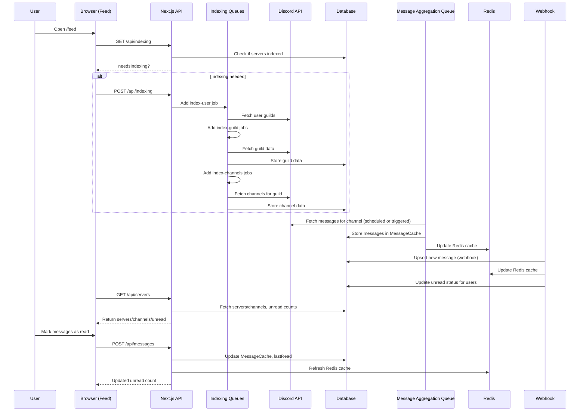

# Message & Channel Indexing Flow

This document describes how DiscordFeed indexes servers, channels, and messages, and how unread message counts are tracked and updated.

---

## Actors

- **User**
- **Browser (Feed Page)**
- **Next.js API** (`/api/indexing`, `/api/servers`, `/api/messages`)
- **Indexing Queues** (Bull: index-user, index-guild, index-channels)
- **Discord API**
- **Database** (Prisma/Postgres)
- **Message Aggregation Queue** (Bull)
- **Redis** (for caching)
- **Webhook** (for real-time message updates)

---

## Sequence of Events

1. **Feed Page Loads**

   - Browser requests `/api/indexing` to check if indexing is needed.
   - If needed, browser POSTs to `/api/indexing` to trigger indexing.

2. **User Indexing Job**

   - `/api/indexing` POST calls `startUserIndexing(userId)`.
   - Adds a job to the `index-user` queue.

3. **Guild Indexing Jobs**

   - `index-user` job fetches user's guilds from Discord API.
   - For each guild, adds a job to the `index-guild` queue.

4. **Channel Indexing Jobs**

   - `index-guild` job stores guild data in DB.
   - For each guild, adds a job to the `index-channels` queue.

5. **Channel Data Storage**

   - `index-channels` job fetches channels for the guild from Discord API.
   - Stores channel data in DB.

6. **Message Aggregation**

   - Message aggregation jobs (scheduled or triggered) fetch messages for each channel from Discord API.
   - Messages are upserted into the MessageCache table and cached in Redis.

7. **Webhook Message Updates**

   - When a new message is received via Discord webhook, it is upserted into the MessageCache and Redis cache is updated.
   - Unread status is updated for users based on their lastRead timestamp.

8. **Feed Page Data Fetch**

   - Browser requests `/api/servers` to get servers/channels and unread counts.
   - API calculates unread counts per channel (using lastRead and message timestamps).

9. **User Reads Messages**
   - User marks messages as read via `/api/messages` POST.
   - Updates MessageCache and lastRead, refreshes Redis cache, and updates unread counts.

---

## Sequence Diagram

---

## Notes

- Indexing is performed in the background using queues for scalability and rate limit handling.
- Message aggregation is both scheduled and event-driven (webhooks).
- Unread counts are calculated using message timestamps and the user's lastRead entry.
- Redis is used for fast access to recent messages and unread counts.

For further details, see the implementation in `app/feed/page.tsx`, `app/api/indexing/route.ts`, `lib/discord/indexQueue.ts`, and related files.
