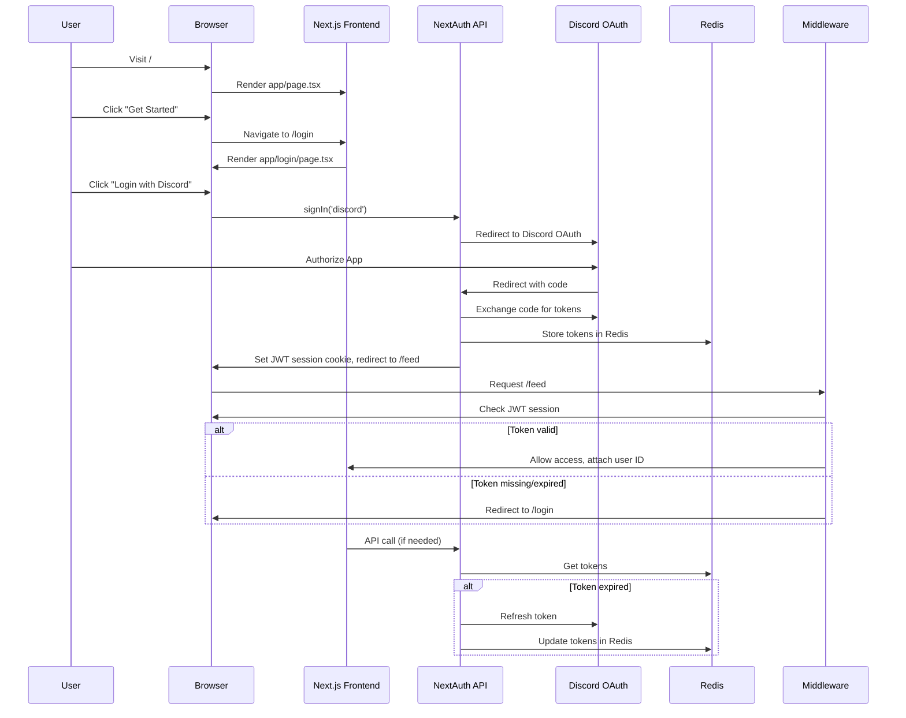

# User Authorization & OAuth Flow

This document describes the user authorization flow for DiscordFeed, from landing on the home page through Discord OAuth and protected route access.

---

## Actors

- **User**
- **Browser**
- **Next.js App (Frontend)**
- **NextAuth API Route (`/api/auth/[...nextauth]`)**
- **Discord OAuth Server**
- **Redis (for token storage)**
- **Middleware (for protected routes)**

---

## Sequence of Events

1. **User lands on `/` (Home Page)**

   - `app/page.tsx` renders the landing page with a "Get Started" button.

2. **User clicks "Get Started"**

   - Browser navigates to `/login`.

3. **Login Page**

   - `app/login/page.tsx` renders a login button.
   - User clicks the login button, which calls `signIn("discord", { callbackUrl: "/feed" })`.

4. **NextAuth Sign-In**

   - NextAuth redirects the browser to Discord's OAuth2 authorization endpoint.

5. **Discord Authorization**

   - User authorizes the app on Discord.
   - Discord redirects back to `/api/auth/callback/discord` with an authorization code.

6. **NextAuth Callback**

   - NextAuth exchanges the code for access and refresh tokens.
   - Tokens are stored in Redis (`storeTokensInRedis`).
   - NextAuth issues a JWT session token to the user (stored in a cookie).
   - User is redirected to `/feed`.

7. **Accessing Protected Route (`/feed`)**

   - Middleware runs for `/feed`.
   - Middleware checks for a valid JWT session token.
     - If missing/expired: redirect to `/login`.
     - If valid: attach user ID to request headers and allow access.

8. **Token Refresh (as needed)**
   - If the access token is expired or about to expire, backend logic (e.g., `lib/discord/api.ts`) refreshes the token using the refresh token and updates Redis.

---

## Sequence Diagram

---

## Notes

- Token storage and refresh are handled transparently for the user.
- Middleware ensures only authenticated users can access protected routes.
- Redis is used for efficient, scalable token management.

For further details, see the implementation in `app/api/auth/[...nextauth]/route.ts`, `middleware.ts`, and related files.
