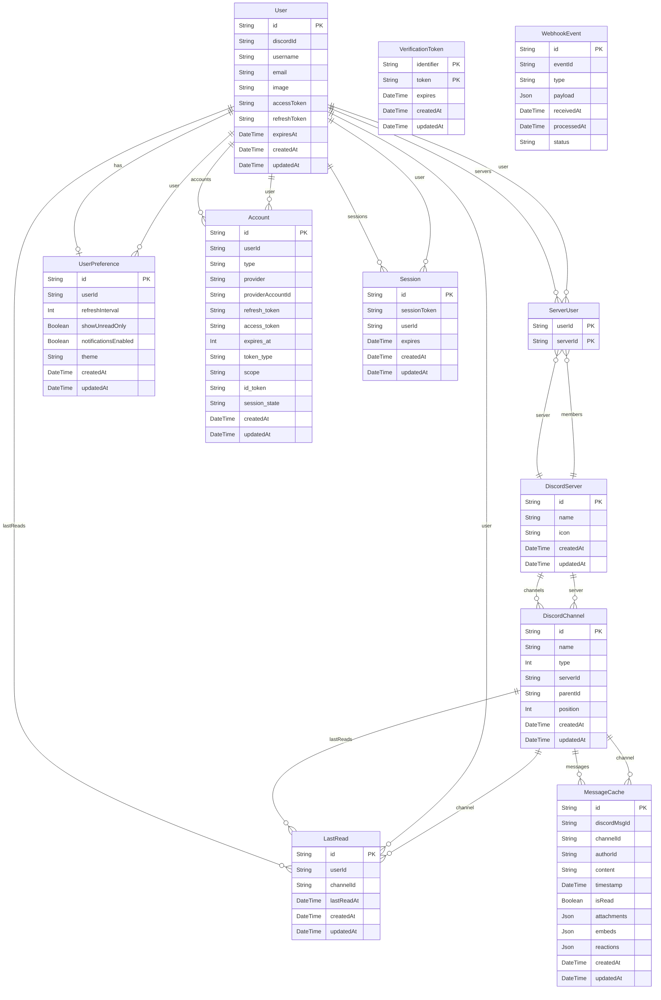

# Prisma in DiscordFeed

This directory contains the Prisma schema and migration files for the DiscordFeed project. Prisma is used as the ORM (Object-Relational Mapping) tool to interact with the PostgreSQL database, providing type-safe database access and migrations.

## Overview

- **Prisma Client**: Auto-generated and type-safe query builder for Node.js & TypeScript.
- **Schema Management**: All database models and relationships are defined in `schema.prisma`.
- **Migrations**: Database schema changes are tracked and managed in the `migrations/` folder.

## Common Prisma Commands

| Script Name       | Command                                                  | Description                                                                           |
| ----------------- | -------------------------------------------------------- | ------------------------------------------------------------------------------------- |
| `db:migrate:init` | `dotenv -e .env.local -- prisma migrate dev --name init` | Initializes the database with the initial migration using the local environment file. |
| `db:migrate:dev`  | `dotenv -e .env.local -- prisma migrate dev`             | Applies new migrations and updates the database in development.                       |
| `db:studio`       | `dotenv -e .env.local -- prisma studio`                  | Opens Prisma Studio, a visual database browser, with the local environment.           |
| `db:generate`     | `dotenv -e .env.local -- prisma generate`                | Generates the Prisma client based on the schema.                                      |

You can run these scripts using `npm run <script-name>` or `yarn <script-name>`.

For example:

```sh
npm run db:migrate:dev
```

Other useful Prisma CLI commands (not in package.json):

| Command                 | Description                                                                        |
| ----------------------- | ---------------------------------------------------------------------------------- |
| `npx prisma db push`    | Pushes the current schema state to the database without creating a migration.      |
| `npx prisma format`     | Formats the Prisma schema file.                                                    |
| `npx prisma validate`   | Validates the Prisma schema for errors.                                            |
| `npx prisma introspect` | Introspects the database and updates the schema to match the current DB structure. |

## Entity Relationship Diagram (ERD)

Below is a Mermaid ER diagram representing all tables and their relationships as defined in `schema.prisma`:



## Developer Notes

- Always run `npx prisma generate` after modifying `schema.prisma` to update the Prisma Client.
- Use migrations to track and apply schema changes in a consistent way.
- Use Prisma Studio (`npx prisma studio`) for easy database inspection and debugging.
- For more information, see the [Prisma documentation](https://www.prisma.io/docs/).
